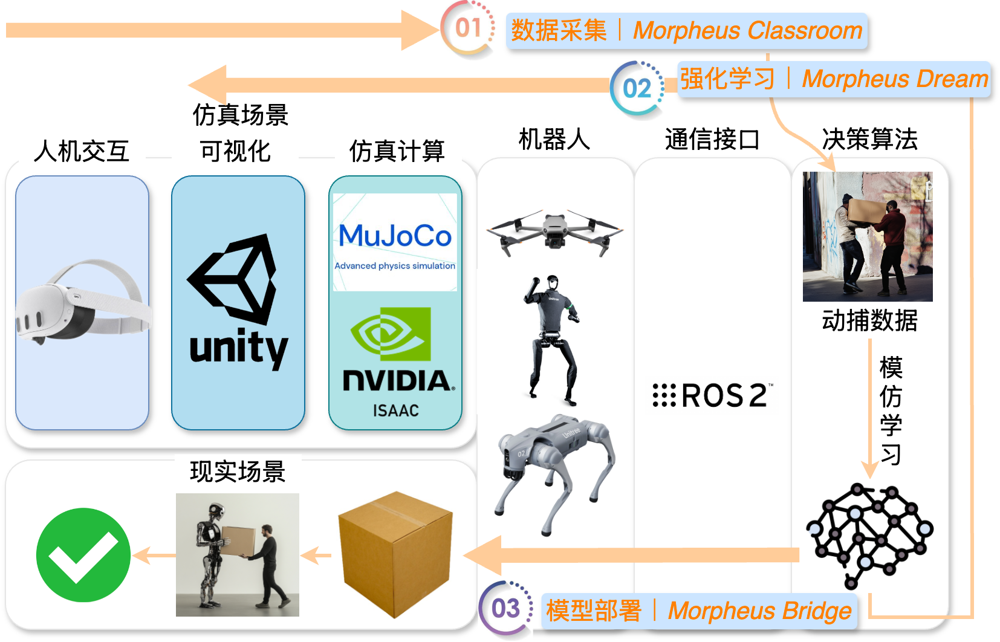
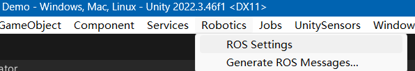
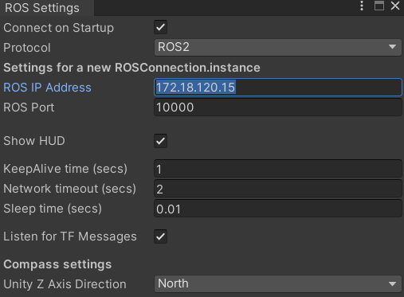
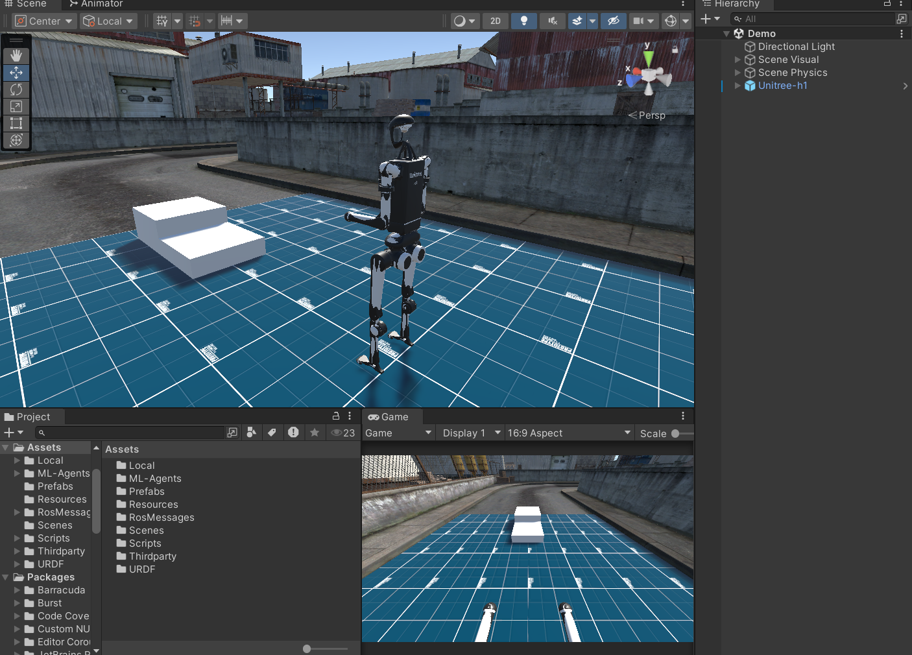

# Morpheus

## Introduction

还在苦恼于MuJoCo拿不出手的上世纪风格渲染吗？难道想要好看的Demo只能去用IsaacLab？我们也有相同的苦恼，因此基于[MuJoCo Unity Plugin](https://github.com/google-deepmind/mujoco/tree/main/unity)开发了Morpheus仿真平台，让Sim-2-Sim也能有拿得出手的Demo！

**本项目的目标是开发一个简单易用并且渲染真实的MuJoCo仿真环境**，集成Unity渲染管线、MuJoCo物理仿真器、基于ROS（Robot Operating System）的机器人数据传输，具备逼真的图像渲染，与原生MuJoCo物理仿真、灵活的环境建模、传感器模拟等功能。

未来还将进一步集成：
	* 基于大语言模型的场景生成
	* AI动作绑定和人机协作
	* Hololens 2进行场景可视化和人体动作捕捉
	* 通过照片生成场景并扩展类似场景
	* 优化人机协作的数据集生成流程
	...

仿真效果与MuJoCo原生环境对比



## How to Deploy

Clone this repository and open with unity 2022 LTS.

Then deploy Morpheus Backend in a `Ubuntu 22.04` system according to backend README:

[Morpheus Backend GitHub Repo](https://github.com/webDrag0n/MorpheusBackend)

## How to Run

After deploying both Morpheus Frontend and Backend, you should be able to run our demo test acse.

Launch Morpheus Backend docker environment and navigate to root directory of Morpheus Backend

execute:

```bash
colcon build
source install/setup.sh
bash start_h1.sh
```

Then open the Morpheus Frontend Unity project, open `Demo` scene in `Assets/Scenes` folder

Open ROS Settings window



Set ROS IP Address as your `docker host machine's IP`



Press play button.

You shoud now be seeing the Unitree h1 robot moving.



You can further execute:
```bash
bash see_h1_status.sh
```

to see the response from simulation environment containing position and rotation.

## Status

- ## Roadmap

✅ MuJoCo

	✅ Unity端插件部署完成
	 
	✅ Unitree MuJoCo部署完成

✅ Unitree h1物理仿真效果测试完成

✅ Unitree sdk2，Unitree sdk2 python

✅ ML-Agent

✅ ROS2 通信

	✅ ROS Plugin：Unity-Robotics-Hub
	 
	✅ ROS2（foxy，humble）与Unity通信完成测试
	 
	✅ ROS2 控制信号控制环境仿真机器人
	 
	✅ ROS2 仿真环境机器人状态回传

▶️ ROS2 传感器仿真

	⏸️ 相机（自然有，只需要接口）
	 
	✅ Lidar传感器
	 
	⏸️ IMU（简单，只需要接口）

▶️ Isaac Sim RL Sim2Sim测试

	✅ 环境部分部署完成
	 
	▶️ 迁移Isaac Gym代码至本平台

▶️ Hololens 2 连接Unity

	✅ Microsoft-MRTK3.0 OpenXR技术栈部署完成
	 
	✅ Hololens 2连接Unity
	 
	⏸️ Hololens 2手部输入反控仿真物体
	 
	⏸️ Hololens 2手部动捕信号回传
	 
	⏸️ Hololens 2相机信号回传

⏸️ 仿真数据录制模块

	Unitree H1
	 
	Unitree Go2
	 
	四旋翼无人机

⏸️ Robomaster机器人MuJoCo模型

⏸️ Unity输出语义分割图

	⏸️ SAM2？或者直接仿真直出


## Contributors

@[webDrag0n](https://github.com/webDrag0n), @[Tsunami](https://github.com/panz1ha0)

## Credits

[MuJoCo Unity Plugin](https://github.com/google-deepmind/mujoco/tree/main/unity)