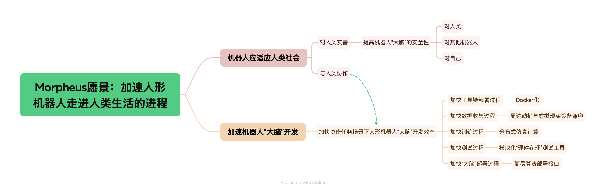
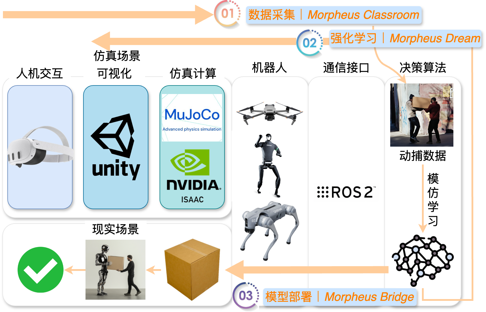

# Morpheus

## Introduction

**本项目的目标是开发一个专注于人-机协同任务的机器人仿真环境**，集成ROS（Robot Operating System）、Unity和MuJoCo的仿真平台，具备高精度的物理仿真、灵活的环境建模、传感器模拟以及基于大语言模型的AI动作绑定和人机协作。通过容器化简化部署，并集成Hololens 2进行场景可视化和人体动作捕捉。该平台还支持通过照片生成场景并扩展类似场景，以及优化人机协作的数据集生成流程。





## How to Deploy

Clone this repository and open with unity 2022 LTS.

Then deploy Morpheus Backend in a `Ubuntu 22.04` system according to backend README:

[Morpheus Backend GitHub Repo](https://github.com/webDrag0n/MorpheusBackend)

## How to Run

After deploying both Morpheus Frontend and Backend, you should be able to run our demo test acse.

Launch Morpheus Backend docker environment and navigate to root directory of Morpheus Backend

execute:

```bash
colcon build
source install/setup.sh
bash start_all.sh
```

Then open the Morpheus Frontend Unity project, open `Demo` scene in `Assets/Scenes` folder, press play button.

You shoud now be seeing the Unitree h1 robot moving.


You can further execute:
```bash
bash see_h1_status.sh
```

to see the response from simulation environment containing position and rotation.

## Status

- ## Roadmap

✅ MuJoCo

	✅ Unity端插件部署完成
	 
	✅ Unitree MuJoCo部署完成

✅ Unitree h1物理仿真效果测试完成

✅ Unitree sdk2，Unitree sdk2 python

✅ ML-Agent

✅ ROS2 通信

	✅ ROS Plugin：Unity-Robotics-Hub
	 
	✅ ROS2（foxy，humble）与Unity通信完成测试
	 
	✅ ROS2 控制信号控制环境仿真机器人
	 
	✅ ROS2 仿真环境机器人状态回传

▶️ ROS2 传感器仿真

	⏸️ 相机（自然有，只需要接口）
	 
	✅ Lidar传感器
	 
	⏸️ IMU（简单，只需要接口）

▶️ Isaac Sim RL Sim2Sim测试

	✅ 环境部分部署完成
	 
	▶️ 迁移Isaac Gym代码至本平台

▶️ Hololens 2 连接Unity

	✅ Microsoft-MRTK3.0 OpenXR技术栈部署完成
	 
	✅ Hololens 2连接Unity
	 
	⏸️ Hololens 2手部输入反控仿真物体
	 
	⏸️ Hololens 2手部动捕信号回传
	 
	⏸️ Hololens 2相机信号回传

⏸️ 仿真数据录制模块

	Unitree H1
	 
	Unitree Go2
	 
	四旋翼无人机

⏸️ Robomaster机器人MuJoCo模型

⏸️ Unity输出语义分割图

	⏸️ SAM2？或者直接仿真直出


## Contributors

@[webDrag0n](https://github.com/webDrag0n), @[Tsunami](https://github.com/panz1ha0)
